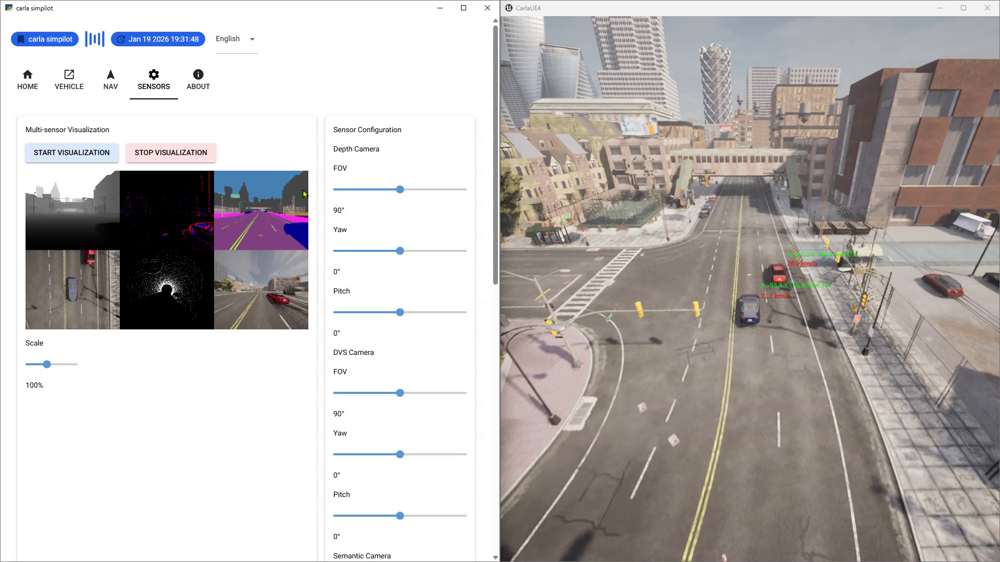

# CARLA SimPilot

[简体中文](#chinese) | [繁體中文](#traditional_chinese) | [English](#english)



---

<a id="chinese"></a>

## 简体中文介绍

**CARLA SimPilot** 是一个基于 Python 和 NiceGUI 开发的轻量级、Web 化的 CARLA 自动驾驶仿真器控制面板。它旨在简化 CARLA 的操作流程，提供直观的车辆控制、传感器可视化、地图导航及环境配置功能。

> **🤖 特别说明**：本项目是由 **人类开发者** 与 **TRAE (AI IDE)** 共同协作完成。Trae 作为一个强大的 AI 编程助手，在代码生成、重构、多语言支持及架构设计方面提供了深度支持。

### ✨ 主要功能

*   **仿真器管理**：一键启动/停止 CARLA 服务端，自动检测运行状态。
*   **车辆控制**：
    *   生成主车（Ego Vehicle）。
    *   切换自动驾驶（Autopilot）/ 手动控制模式。
    *   支持上帝视角（Spectator）智能跟随（后方视角、鸟瞰视角等）。
*   **地图与导航**：
    *   实时 2D 地图显示（基于 OpenDRIVE 解析）。
    *   支持缩放、平移。
    *   设置导航目的地，实时规划并显示路径。
*   **传感器可视化**：
    *   集成 IMU、GNSS、相机（RGB/深度/分割）、激光雷达（Lidar）数据展示。
    *   实时查看传感器参数与状态。
*   **环境配置**：
    *   动态调整天气（阳光、雨雾、昼夜）。
    *   交通管理器（Traffic Manager）：生成并控制 NPC 车辆与行人。
*   **多语言支持**：内置 简体中文、繁体中文、English 切换。

### 🛠️ 技术栈

*   **Python**: 核心逻辑
*   **NiceGUI**: Web UI 框架
*   **CARLA Python API**: 仿真交互
*   **Pygame**: 2D 地图渲染

### � 快速开始

1.  **环境要求**：
    *   Python 3.8+
    *   CARLA 0.9.16 (推荐) 或其他兼容版本 (0.9.x)
2.  **安装依赖**：
    ```bash
    pip install nicegui carla pygame psutil Pillow
    ```
    *(注：CARLA Python API 也可以通过 CARLA 安装目录下的 egg 文件安装)*
3.  **运行**：
    ```bash
    python main.py
    ```
4.  **配置**：
    启动后，在“主页”设置 CARLA 模拟器的可执行文件路径（例如 `CarlaUE4.exe`），即可一键启动模拟器。

### �👨‍💻 作者

*   **作者**: Ke Yingjie
*   **联系方式**: yingjieke@gmail.com

### 📄 许可证

本项目采用 [MIT License](LICENSE) 许可证。

---

<a id="traditional_chinese"></a>

## 繁體中文介紹

**CARLA SimPilot** 是一個基於 Python 和 NiceGUI 開發的輕量級、Web 化的 CARLA 自動駕駛模擬器控制面板。它旨在簡化 CARLA 的操作流程，提供直觀的車輛控制、感測器可視化、地圖導航及環境配置功能。

> **🤖 特別說明**：本專案是由 **人類開發者** 與 **TRAE (AI IDE)** 共同協作完成。Trae 作為一個強大的 AI 編程助手，在程式碼生成、重構、多語言支援及架構設計方面提供了深度支援。

### ✨ 主要功能

*   **模擬器管理**：一鍵啟動/停止 CARLA 伺服器端，自動檢測運行狀態。
*   **車輛控制**：
    *   生成主車（Ego Vehicle）。
    *   切換自動駕駛（Autopilot）/ 手動控制模式。
    *   支援上帝視角（Spectator）智能跟隨（後方視角、鳥瞰視角等）。
*   **地圖與導航**：
    *   即時 2D 地圖顯示（基於 OpenDRIVE 解析）。
    *   支援縮放、平移。
    *   設置導航目的地，即時規劃並顯示路徑。
*   **感測器可視化**：
    *   集成 IMU、GNSS、相機（RGB/深度/分割）、雷射雷達（Lidar）數據展示。
    *   即時查看感測器參數與狀態。
*   **環境配置**：
    *   動態調整天氣（陽光、雨霧、晝夜）。
    *   交通管理器（Traffic Manager）：生成並控制 NPC 車輛與行人。
*   **多語言支援**：內置 簡體中文、繁體中文、English 切換。

### 🛠️ 技術棧

*   **Python**: 核心邏輯
*   **NiceGUI**: Web UI 框架
*   **CARLA Python API**: 模擬交互
*   **Pygame**: 2D 地圖渲染

### 🚀 快速開始

1.  **環境要求**：
    *   Python 3.8+
    *   CARLA 0.9.16 (推薦) 或其他兼容版本 (0.9.x)
2.  **安裝依賴**：
    ```bash
    pip install nicegui carla pygame psutil Pillow 
    ```
    *(註：CARLA Python API 也可以通過 CARLA 安裝目錄下的 egg 文件安裝)*
3.  **運行**：
    ```bash
    python main.py
    ```
4.  **配置**：
    啟動後，在「主頁」設置 CARLA 模擬器的可執行文件路徑（例如 `CarlaUE4.exe`），即可一鍵啟動模擬器。

### 👨‍💻 作者

*   **作者**: Ke Yingjie
*   **聯絡方式**: yingjieke@gmail.com

### 📄 許可證

本專案採用 [MIT License](LICENSE) 許可證。

---

<a id="english"></a>

## English Introduction

**CARLA SimPilot** is a lightweight, web-based control panel for the CARLA Autonomous Driving Simulator, built with Python and NiceGUI. It aims to simplify CARLA operations by providing an intuitive interface for vehicle control, sensor visualization, map navigation, and environment configuration.

> **🤖 Special Note**: This project is a result of a collaboration between a **Human Developer** and **TRAE (AI IDE)**. TRAE, as a powerful AI programming assistant, provided deep support in code generation, refactoring, multi-language implementation, and architectural design.

### ✨ Key Features

*   **Simulator Management**: One-click start/stop of the CARLA server with auto-detection.
*   **Vehicle Control**:
    *   Spawn Ego Vehicle.
    *   Toggle Autopilot / Manual control.
    *   Smart Spectator camera follow modes (Shoulder view, Top-down, etc.).
*   **Map & Navigation**:
    *   Real-time 2D map rendering (OpenDRIVE based).
    *   Zoom and pan support.
    *   Set navigation destination with real-time path planning.
*   **Sensor Visualization**:
    *   Integrated display for IMU, GNSS, Camera (RGB/Depth/Seg), and Lidar.
    *   Real-time sensor parameter monitoring.
*   **Environment Setup**:
    *   Dynamic weather control (Sun, Rain, Fog, Day/Night).
    *   Traffic Manager: Spawn and control NPC vehicles and walkers.
*   **Multi-language Support**: Built-in switching for Simplified Chinese, Traditional Chinese, and English.

### 🛠️ Tech Stack

*   **Python**: Core Logic
*   **NiceGUI**: Web UI Framework
*   **CARLA Python API**: Simulation Interaction
*   **Pygame**: 2D Map Rendering

### 🚀 Quick Start

1.  **Prerequisites**:
    *   Python 3.8+
    *   CARLA 0.9.16 (Recommended) or compatible 0.9.x versions
2.  **Install Dependencies**:
    ```bash
    pip install nicegui carla pygame psutil Pillow
    ```
    *(Note: CARLA Python API can also be installed via the egg file in the CARLA installation directory)*
3.  **Run**:
    ```bash
    python main.py
    ```
4.  **Configuration**:
    After launching, set the path to the CARLA simulator executable (e.g., `CarlaUE4.exe`) in the "Home" tab to enable one-click startup.

### 👨‍💻 Author

*   **Author**: Ke Yingjie
*   **Contact**: yingjieke@gmail.com

### 📄 License

This project is licensed under the [MIT License](LICENSE).

### DemoShow
<div align="center">
    <video src="assets/demo_show.mp4" width="100%" controls autoplay loop muted></video>
</div>
